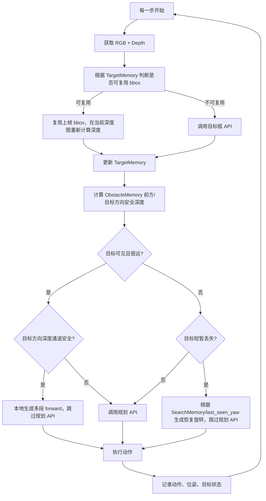

# 上下文管理技术流程

## 1. 目标

当前系统原本主要依赖单帧 RGB + 深度 + VLM 规划。单帧闭环容易出现两个问题：

- **目标短暂丢失**：无人机接近目标、目标出画或转向时，VLM 可能把其他物体当成新目标。
- **频繁调用 VLM**：每一步都做目标框 API + 规划 API，演示等待时间较长。

上下文管理模块的目标是：**不改变现有 VLM 主流程，只在可靠场景下用结构化记忆减少调用，并在目标丢失时避免立即换错目标。**

## 2. 论文思路对应

- **OnFly**：使用 Hybrid Memory 保留关键帧与最近帧，解决长程进度监控和目标丢失问题。
- **Uni-LaViRA**：使用 TDM 维护任务进度，不把完整历史直接塞进模型，而是维护结构化状态。
- **FineCog-Nav**：将导航记忆分为 step、subgoal、instruction 等层级，减少长上下文噪声。
- **LookasideVLN**：记录历史地标，目标不可见时可根据历史空间关系恢复。
- **WorldVLN**：将历史观测与已执行动作写入自回归上下文，执行后再更新状态。

本项目采用轻量实现：**TargetMemory + TaskMemory + SearchMemory + ObstacleMemory + VLMCallPolicy**。

## 3. 模块结构

### 3.1 TargetMemory

记录当前被锁定的导航目标：

- `target_class`：目标类别，例如 `car`
- `bbox`：上一次确认的 RGB 目标框
- `depth_median`：目标框内深度中位数
- `confidence`：目标框置信度
- `visible_streak`：连续可见次数
- `lost_streak`：连续丢失次数
- `last_seen_yaw`：上次看到目标时的航向角
- `depth_history` / `bbox_history`：最近深度和框历史

作用：防止目标从“远处汽车”突然切换成“近处假汽车”。

### 3.2 TaskMemory

记录任务执行进度：

- `instruction`：原始任务描述
- `accumulated_forward_distance`：累计前进距离
- `executed_actions`：已执行动作
- `current_state`：`SEARCHING / APPROACHING / ARRIVED / RECOVERING`

作用：让系统知道自己在持续完成同一个任务，而不是每帧重新理解任务。

### 3.3 SearchMemory

记录目标丢失后的旋转搜索过程：

- `scan_start_yaw`：开始搜索时的航向
- `scan_steps`：搜索步数
- `seen_candidates`：搜索过程中见过的目标
- `best_seen_target`：搜索中置信度最高的目标

作用：避免“旋转过程中第 2 次看到目标，但第 4 次当前帧没目标就忘了”的问题。

### 3.4 ObstacleMemory

记录当前深度图中的局部安全通道：

- `front_safe_depth`：画面中心前方通道 10% 分位深度
- `target_corridor_safe_depth`：目标方向通道 10% 分位深度
- `blocked`：是否被近障碍物阻挡

作用：目标深度很远时，不能盲目连续前进；必须先确认中间通道安全。

当前默认区域较窄，避免把近处地面、树和房屋边缘误算成前方障碍：

- `front_safe_depth`：深度图 `x=47%~53%`，`y=45%~60%`
- `target_corridor_safe_depth`：以目标框中心 `x` 为中心，横向 `±5%`，`y=45%~65%`

这些比例可通过 `.env` 中的 `PLANNER_CONTEXT_FRONT_CORRIDOR_*` 和 `PLANNER_CONTEXT_TARGET_CORRIDOR_*` 调整。

## 4. 决策流程



当前实现的核心不是“某个 if 规则”，而是统一观测状态机。  
目标 bbox API 的输出只被视为候选观测，必须先经过 `evaluate_observation()`，再决定是否允许本地动作。

| 状态 | 含义 | 本地 forward | 本地 done | 规划 API |
|---|---|---:|---:|---:|
| `INIT_DETECT` | 首次锁定目标实例 | 远距离且安全时允许 | 仅靠近类任务允许 | 视情况 |
| `TRACKING` | 当前观测与锁定目标一致 | 允许 | 仅靠近类任务允许 | 视情况 |
| `NEAR_GOAL_CONFIRM` | 运动补偿判断已到目标附近 | 禁止 | 靠近类任务允许 | 关系类任务必须调用 |
| `LOST_OR_OCCLUDED` | 当前观测不符合锁定目标 | 禁止 | 禁止 | 无恢复动作时调用 |
| `RELOCALIZE` | 围绕历史目标方向重定位 | 禁止 | 禁止 | 扫描失败后调用 |
| `REDETECT` | 无可靠目标记忆或重检测 | 禁止 | 禁止 | 调用 |

最重要的动作放行原则：

```text
只有 INIT_DETECT/TRACKING 且观测一致时，才允许本地连续 forward。
只要进入 LOST_OR_OCCLUDED / NEAR_GOAL_CONFIRM / RELOCALIZE，就禁止本地 forward。
```

## 5. VLM 调用策略

| 场景 | 目标框 API | 规划 API |
|---|---:|---:|
| 首次识别目标 | 调用 | 调用 |
| 刚锁定目标且运动很小 | 跳过，复用 bbox 并重算当前深度 | 视情况调用 |
| 目标远且通道安全 | 可调用或复用 | 跳过，本地生成多段 `forward` |
| 目标远但通道不安全 | 调用或复用 | 调用，让 VLM 重新规划 |
| 目标丢失 1-2 帧 | 不立即换目标 | 跳过，按历史方向恢复 |
| 目标连续丢失超过阈值 | 重新检测 | 调用 |
| 新目标与旧目标深度差异过大 | 拒绝单帧切换 | 使用旧目标记忆或重检测 |

## 6. 安全规则

1. **复用的是 bbox，不复用深度**：每一步都使用当前深度图重新计算目标距离。
2. **远距离前进必须检查通道深度**：目标 50m 不代表中间 50m 没有障碍。
3. **单帧新目标不直接替换旧目标**：先用运动补偿深度、类别一致性和世界方位一致性判断。
4. **目标丢失先恢复，不立刻重置任务**：短暂丢失时围绕历史目标世界方位做扇形扫描。
5. **搜索过程中保存候选**：即使当前帧没目标，也不会忘记扫描中曾经看见过的目标。
6. **超过丢失阈值才允许重新检测**：默认连续丢失 2 步后允许完整重检测。
7. **到达半径只用于靠近类任务**：只有“靠近/旁边/附近/near/beside”等任务可按深度半径本地完成；“上方/屋顶/绕过/穿过/左右侧”等关系任务必须继续交给规划 API 判断。

## 7. 通用目标丢失重定位

当前实现不再使用固定的 `right 15 / left 15` 左右摇头，而是维护目标方位和候选池：

- `target_bearing_deg`：目标 bbox 中心相对图像中心的角度，按相机 FOV 计算。
- `target_world_yaw`：`无人机 yaw + target_bearing_deg`，表示目标在世界坐标中的历史方向。
- `accumulated_forward_at_last_seen`：上次确认目标时已经累计前进的距离。
- `suspicious_candidates`：被拒绝的可疑目标不会丢弃，而是进入候选池。

目标切换判断使用运动补偿深度：

```text
expected_depth = last_depth - (当前累计前进距离 - 上次确认目标时累计前进距离)
```

如果新检测目标的深度接近 `expected_depth`，即使深度和上一帧差异很大，也会接受为同一目标。  
例如上一帧目标 `12m`，之后前进 `8m`，当前检测 `4m`，这是合理接近，不应判为假目标。

目标丢失后的扫描以历史目标世界方向为中心：

```text
0°, -15°, +15°, -30°, +30°, -45°, +45°, -60°, +60°
```

如果候选池里出现高分候选，则优先围绕该候选方向恢复；否则围绕历史目标方向恢复。

## 8. 当前实现位置

- `agent/context_manager.py`：结构化上下文管理模块。
- `agent/planner.py`：接入 bbox 复用、本地直行、本地恢复动作。
- `run_airsim_web.py`：向规划器传入当前 `step / pose / yaw`，并加载上下文配置。
- `.env.example`：新增上下文管理相关环境变量。

## 9. 可行性结论

该方案可行，且不会破坏现有主流程：

- 如果上下文条件不满足，系统自动回到原来的目标框 API + 规划 API。
- 本地连续前进只在目标深度足够远且深度通道安全时触发。
- 目标丢失恢复只处理短期丢失，超过阈值仍回到 VLM 检测。
- 所有功能都可通过环境变量关闭，便于演示前快速回退。
# 新增：场景物体深度辅助规划

当前临时切换为“VLM检测场景物体 + 程序计算深度 + VLM避障规划”的流程：

```text
RGB + 任务
→ VLM输出 target 和 objects（目标、障碍物、参照物）的bbox、位置描述
→ 程序对每个bbox从AirSim原始深度矩阵计算深度
→ 将 obj id、role、name、position、bbox、depth 一起写入规划提示词
→ 规划VLM根据目标和障碍物深度输出多条候选轨迹
```

为了观察该方案效果，当前暂时关闭两类硬限制：

- `PLANNER_MAX_FORWARD_STEP=inf`
- `PLANNER_MAX_TRACKING_YAW_STEP_DEG=inf`
- `PLANNER_CONTEXT_LOCAL_FORWARD_ENABLED=0`

这样 VLM 输出的 `forward 23`、`left 90`、`right 90` 不会被程序自动裁小；后续根据实验效果再决定是否重新加入分场景限制。

该方案的核心变化是：不再用程序安全通道直接决定前进距离，而是把障碍物位置和深度明确交给VLM，让VLM生成绕行路线。

---

# 新增：目标世界坐标记忆

本次将上下文管理从“只记录目标历史方位”增强为“记录目标大致世界坐标”。

## 原理

当 bbox API 找到目标后，系统已经知道当前无人机世界坐标、当前偏航角、目标 bbox 中心相对图像中心的水平角，以及目标 bbox 区域的中位深度，因此可以估算：

```text
target_world_yaw = yaw + bearing
target_x = drone_x + depth * cos(target_world_yaw)
target_y = drone_y + depth * sin(target_world_yaw)
target_z = drone_z
```

该位置不是精确三维重建，而是用于目标丢失后的恢复导航锚点。

## 新恢复逻辑

目标短暂丢失时，不再只按上一次看到目标时的固定 yaw 搜索，而是：

```text
当前无人机位置 + 目标世界坐标
→ 重新计算当前应该朝向目标的 yaw
→ 朝该方向小角度旋转
→ 再围绕该方向做扇形搜索
```

这样即使无人机已经前进或横向偏移，恢复方向也会随当前位置动态变化。

## 作用

- 减少固定 left/right 摇头搜索的局限；
- 避免无人机移动后仍按照旧 yaw 搜索；
- 到达目标附近但当前帧看不到目标时，可以根据历史目标位置辅助判断；
- 后续多阶段任务可以把目标世界坐标作为阶段记忆的一部分。

---
