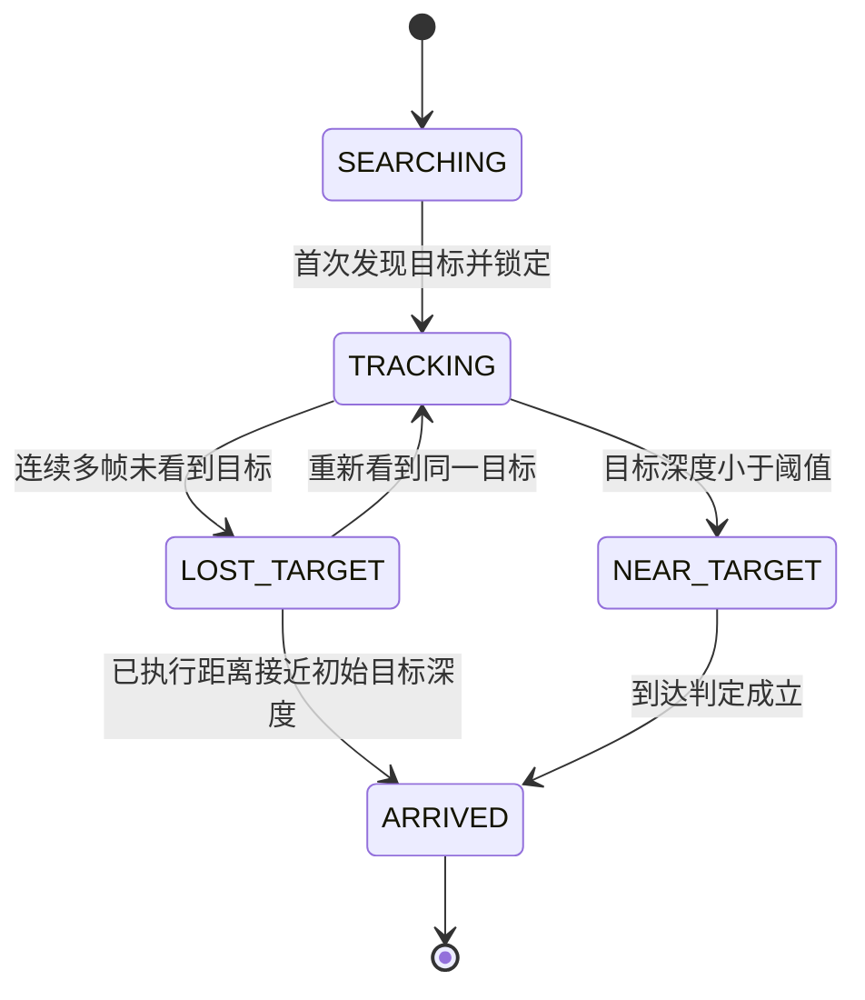

# 规划器组周报(2026/6/24)
源码链接[github](https://github.com/Sakuraandroxy/Planner)
## 1. 本周核心进展

本周围绕 **AirSim 仿真环境 + Web 可视化界面 + 多模态大模型 VLM**，完成了一个可运行的无人机闭环导航原型。

系统从 Web 页面接收自然语言任务，例如“飞到前面第一辆汽车上面”，然后自动完成：

1. 从 AirSim 获取无人机第一视角 RGB 图、深度图和位姿。
2. 调用 VLM 理解当前画面和任务目标。
3. 让 VLM 输出多条候选轨迹和最终选择。
4. 程序解析轨迹[right 10°, forward 5m],转换成世界模型输入[Δx=5*cosφ,Δy=5*sinφ,Δz=0,Δφ=10] (无人机坐标系)和airsim输入[x=x'+5*cosφ, y=y'+5*sinφ, z=z', φ=φ'+10] (世界坐标系)。
5. 无人机执行动作后进入下一帧，再次观察、规划和执行。


## 2. 项目目录与模块分工

当前项目主线代码按功能拆成 5 个部分：

```text
E:\uni-lavira-code-main
├─ run_airsim_web.py          # 主入口：连接 AirSim、启动 Web、驱动闭环
├─ agent/                     # VLM 智能体层：提示词构造、API 调用、结果解析
├─ planner/                   # 规划配置与动作表示：参数、轨迹、动作尺度
├─ sim/                       # AirSim 仿真接口层：取图、取深度、取位姿、执行动作
└─ web/                       # 后端与前端页面：状态共享、接口、Dashboard
```

各模块作用如下：

| 目录 / 文件 | 主要职责 | 汇报时可以这样讲 |
|---|---|---|
| `run_airsim_web.py` | 系统主循环 | 负责把 AirSim、VLM Planner 和 Web Dashboard 串起来，是整个闭环的大脑调度器 |
| `sim/airsim_client.py` | AirSim API 封装 | 把 AirSim 的取 RGB、取深度、取位姿、起飞、移动、旋转等接口统一封装 |
| `sim/action_executor.py` | 动作执行 | 把 VLM 输出的 `forward 5`、`left 10` 等动作转换成 AirSim 航点或偏航控制 |
| `sim/frame_capturer.py` | 后台画面刷新 | 给前端低频刷新深度图、高频刷新 RGB 图，不参与最终规划决策 |
| `agent/planner.py` | VLM 规划编排 | 先做目标深度估计，再构造规划提示词，调用 VLM 生成候选轨迹 |
| `agent/target_depth.py` | 目标深度估计 | 让 VLM 找目标 bbox，程序再从 AirSim 原始深度矩阵中计算目标真实深度 |
| `agent/prompt_builder.py` | 提示词构造 | 把任务、RGB 图、深度统计、动作约束组织成 VLM 输入 |
| `agent/vlm_client.py` | API 调用 | 通过 OpenAI 兼容接口调用当前配置的多模态模型 |
| `agent/response_parser.py` | 输出解析与安全裁剪 | 解析 VLM JSON，并限制过大的前进距离和旋转角度 |
| `planner/config.py` | 全局参数 | 管理步长、最大前进距离、最大旋转角、速度、模型参数等超参 |
| `planner/trajectory.py` | 动作与轨迹表示 | 计算动作序列对应的相对位移，用于展示和执行 |
| `web/app.py` | Flask 后端接口 | 提供 `/task`、`/frame`、`/depth_frame`、`/events` 等接口 |
| `web/shared_state.py` | 状态共享 | 主循环和前端之间共享状态、图像、候选轨迹和推理结果 |
| `web/frontend/` | Web Dashboard | 展示 RGB、深度图、任务状态、候选轨迹、VLM 推理摘要 |


## 3. 深度估计方案迭代

本周重点解决了“VLM 如何知道目标真实距离”的问题。

最初想法是把深度图直接作为第二张图传给 VLM，让模型自己读深度；实际测试发现这种方式不稳定，模型定位目标后只能从深度图得到相对深度(颜色越深越近，越浅越远)而并不能得到精确物理数值，导致常常越过目标或者飞行距离太小

当前采用的新方案是：


- **VLM 负责视觉语义**：判断任务目标在哪里，给出rgb图中的边界框(归一化到0-1)
- **程序负责几何深度**：归一化边界框->实际rgb边界框->深度图边界框->从AirSim 原始深度矩阵中读取真实距离。
- **规划 VLM 使用程序给出的深度数字**：不再让模型自己看深度图猜距离。

缺点：每一步两次调用VLM，耗时


## 4. 飞行安全约束

本周发现一个重要问题：当目标很远时，VLM 可能输出一次性长距离前进，例如 `forward 100`，可能越过目标。

因此新增了安全约束：

- `max_forward_step`：限制单次最大前进距离，默认 10m。
- `max_tracking_yaw_step_deg`：当目标可见时，限制单次旋转角最大10°，避免无人机偏离目标。
- 如果目标不可见，才允许较大角度旋转搜索。


当前策略是：  
**宁愿多走几轮闭环，也不让无人机一次性飞很远。**

## 5. 当前仍存在的问题

当前系统已经可以完成基础闭环，但仍有几个需要继续解决的问题：

1. **远距离小目标深度仍可能不稳定**  
   RGB 分辨率较高，但深度矩阵较低。远处车辆映射到深度图后只占少量像素，容易采到背景或道路深度。

2. **单帧决策容易误识别目标**  
   如果无人机已经到达目标附近，但当前帧刚好拍不到原目标，VLM 可能把画面里的另一个相似物体当成新目标。

3. **任务完成判定还不够可靠**  
   目前主要依赖 VLM 当前帧判断，没有充分结合历史目标深度、已执行距离和目标连续丢失状态。

 - 2 3 可以归纳为缺少上下文问题
## 6. 未来计划

### 6.1 解决单帧视觉不可靠问题

后续计划引入 `TargetTracker`，让系统具备目标记忆，而不是每一帧都完全重新相信 VLM。



`TargetTracker` 计划维护：

- 锁定目标类别、颜色、bbox 和历史深度；
- 初始目标深度；
- 最近一次有效目标深度；
- 已执行 forward 总距离；
- 目标连续丢失帧数；
- 当前状态：`SEARCHING / TRACKING / NEAR_TARGET / ARRIVED / LOST_TARGET`。

核心策略：

- 第一次发现目标后锁定目标，后续不允许随意切换到另一个相似目标。
- 如果目标短暂消失，不立刻追新目标，而是结合历史距离判断是否已经到达。
- 当目标深度小于阈值，或累计前进距离接近初始目标距离时，优先进入 `NEAR_TARGET / ARRIVED`。
- 只有长时间丢失且明显未到达时，才重新搜索目标。

### 6.2 优化远距离目标深度估计

- 对远距离小 bbox 增加中心区域采样、扩张采样和分位数统计。
- 比较 `median / min / p10 / p20`，减少背景深度对结果的影响。
- 根据目标大小动态调整采样区域。
- 在日志中增加更多深度采样诊断信息。


### 6.3 增强任务完成判定

- 引入到达半径，例如 `arrival_distance_threshold=3m`。
- 结合目标深度、累计前进距离、目标丢失帧数和 VLM 判断共同决定是否完成。
- 到达后自动悬停并清空任务，避免继续追逐其他假目标。

### 6.4 实现世界模型接口
- 将世界模型输出的预测帧作为vlm输入来打分，优化轨迹选择

## 7. 本周结论

本周的主要成果是：完成了一个可运行的 **AirSim-VLM-Web 无人机闭环导航系统**。

本周最大的提升有三点：

1. **系统闭环打通**：Web 输入、AirSim 感知、VLM 规划、动作执行和前端展示已经连成完整链路。
2. **深度方案更可靠**：不再让 VLM 直接猜深度，而是由程序从 AirSim 原始深度矩阵计算目标距离。
3. **运行更安全可控**：增加最大前进距离、旋转限制

